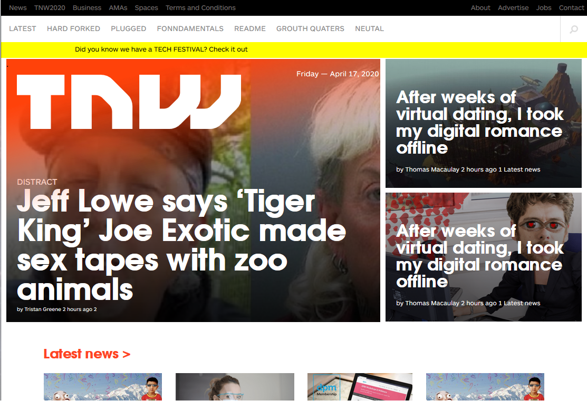

# The Next Web Clone

    This project consists of replicating the The Next Web website putting emphasis on how it behaves
    differently depending on the size of the screen where the website is rendered.

## :package: Built With

    - Plain HTML5
    - Pure CSS3

## :mag: Live Demo

[Live Demo Link](https://rawcdn.githack.com/mcervantes71/The_Next_Web_Clone/7c18fd1f6d6c29326f55fef053c9edf6f9040e72/index.html)

## :computer: Getting Started

    To get a local copy up and running follow these simple steps.

### Install

    Download the repository.

### Usage

    In any browser, open the index.html file.

## :busts_in_silhouette: Authors

👤 **Author1**

- Gmail: [Martin Cervantes](mailto:cervantes.martine@gmail.com)
- Github: [@mcervantes71](https://github.com/mcervantes71)
- Twitter: [@M4rt1nC3rv4nt3s](https://twitter.com/M4rt1nC3rv4nt3s)
- Linkedin: [Martin Cervantes](https://www.linkedin.com/in/cervantesmartin/)

👤 **Author2**

- Gmail: [Gabriel Hilarion](mailto:gabrielhilarion@gmail.com)
- Github: [@gabrie-lHilarion](https://github.com/gabrie-lHilarion)
- Twitter: [@gabrielDeman](https://twitter.com/gabrielDeman)
- Linkedin: [Gabriel Hilarion](https://www.linkedin.com/in/gabrielhilarion/)

## 🤝 Contributing

    Contributions, issues and feature requests are welcome!

Feel free to check the [issues page](../../issues).

## :star2: Show your support

    Give a ⭐️ if you like this project!

## 📝 License

This project is [MIT](lic.url) licensed.
